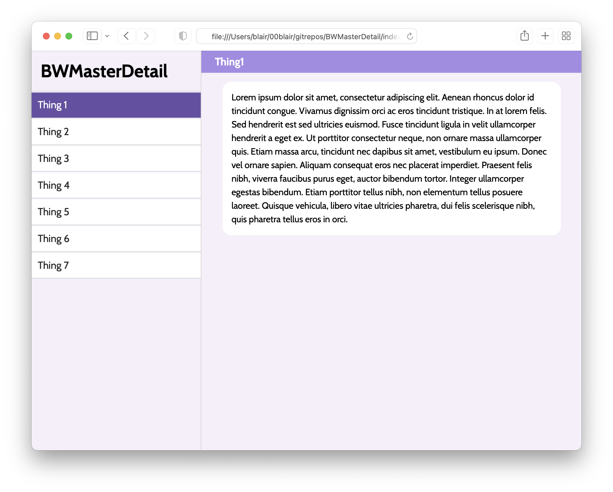

# BWMasterDetail

_BWMasterDetail_ is an implementation of a responsive master-detail view using jQuery and jQuery UI.

- When the screen or window is **wider than 600 pixels (i.e., tablet/desktop view)**, you get the full view with master and detail both concurrently visible.

- When the screen or window is **narrower than 600 pixels (i.e., mobile view)**, you only see the master menu at first, then you can click into one of the detail items.

This is the user experience of typical iOS and Android apps including:

- Email apps (master: list of emails; detail: content of the selected email)
- Messaging apps (master: list of chats; detail: chat log of the selected chat)
- Settings apps (master: category i.e., Wifi/Bluetooth/etc.; detail: settings for selected category)

This is much more appropriate than the typical Bootstrap navigation-bar-turning-into-menu user experience in situations where there are many menu items, or the menu items have long(ish) names, so you can avoid the situation with an awfully cramped navigation bar at the top of the screen.

Although others have implemented similar things in [Angular](https://blewpri.medium.com/angular-8-responsive-master-detail-3b4d591b3294), [React](https://blewpri.medium.com/react-responsive-master-detail-10b60b739879) and [Flutter](https://bettercoding.dev/flutter/responsive-master-detail/), I wanted something that I could use without being locked into one of those heavier frameworks. To be fair, jQuery is still a framework, but it's a significantly more flexible one. Licensed under MIT, please feel free to use on your projects :)